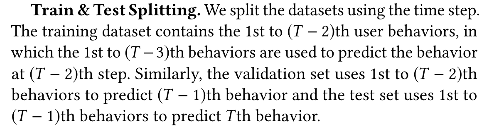

## 数据集处理

#### 开源数据集

- [Tmall](https://tianchi.aliyun.com/dataset/42)下载data_format1 .zip，将其中user_log_format1.csv重命名为user_log.csv移动到long-sequential-modeling/data/tmall
- [Alipay](https://tianchi.aliyun.com/dataset/53)下载IJCAI16_data.zip，将其中ijcai2016_taobao.csv重命名为user_log.csv移动到long-sequential-modeling/data/alipay

- [Taobao](https://tianchi.aliyun.com/dataset/649)下载UserBehavior.csv.zip，解压后移动到long-sequential-modeling/data/taobao

#### 预处理代码

- 以上3个数据集的预处理代码已经实现，预处理命令在[script](./script)文件夹下
- 已经预处理好的数据集路径[long-sequential-modeling/data]

#### 实现新数据集

如果要增加更多数据集，可以参考[Taobao数据集的处理代码](./taobao_v4.py)，一些实现细节解释如下

**数据集格式**

- 经过预处理后，每个样本包括（按顺序）包括以下特征：[uid, target_iid, target_cid, label, hist_iid, hist_cid]
    - uid代表用户的id
    - target_iid代表目标物品的id
    - target_cid代表目标物品的类别id
    - label代表是否用户点击target，是一个维度为2的one_hot向量
    - hist_iid代表用户历史上点击过的物品的id
    - hist_cid代表用户历史上点击过的物品的类别id
    - **其中uid、iid、cid的下标都从1开始，这是为了方便与Padding进行区分**

**关于hist_iid和hist_cid的说明**

- 在预处理过程中，**需要对用户点击过的物品按照点击时间排序**
  ，hist_iid和hist_cid序列中index越大的位置对应用户越近时刻点击的物品，例如hist_iid[-1]
  就代表用户最近点击的物品
    - 按照时间排序的预处理代码可以参考[Tmall](./tmall_sort_log.py)和[Alipay](./alipay_sort_log.py)
      的实现，Taobao已经排序好因此不需要这一步处理
- 截断策略：默认最大长度为200，当用户的实际点击序列长度超过200时只截取最后200个点击
- Padding策略：对于长度不足的200的点击序列，会补0进行Padding到总长度为200

**Filtering**

- 预处理过程中会移除点击序列长度不足10的用户

**Train/Val/Test划分**

- 数据集划分参考下图中的描述
- 以某用户共点击过100个物品为例，对应的样本划分为：
    - Train sample
        - target_iid: [98]
        - hist_iid: [1-97]
    - Val sample
        - target_iid: [99]
        - hist_iid: [1-98]
    - Test sample
        - target_iid: [100]
        - hist_iid: [1-99]

**负样本采样**

- 由于原始数据集中一般只包含正样本，因此需要对负样本进行采样
- 负样本采样策略：对于每个用户，随机采样一个**未点击过**的物品作为负样本，随机采样的权重正比于物品在数据集中出现的频率
- 正负样本比：Train/Val/Test中正负样本比例默认取1:2
- **特别注意：在每次预处理数据集的过程中负样本都是随机采样的，因此不同数据集下的结果不可比较，请注意确保数据集的一致性**
